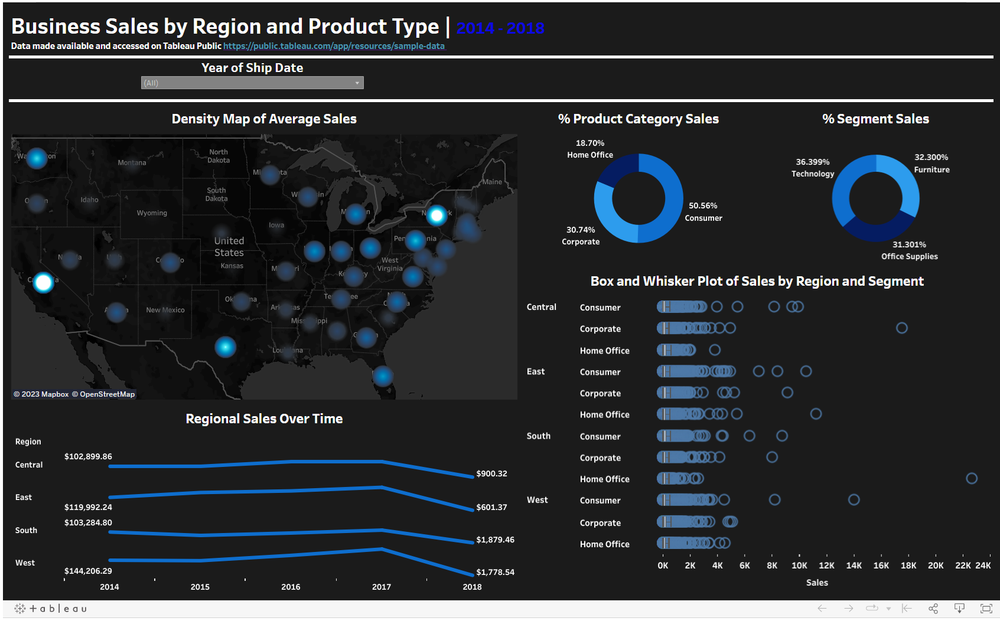

## Superstore Analysis Tableau Dashboards
This repository links to multiple sales, profit, and business forecast dashboards that use the Superstore data set from Tableau. Multiple visualization styles are demonstrated over various color schemes: sunburst chart, area chart, donut charts, mapping, etc.

Sources/Citations:
Superstore data made available and accessed on [Tableau Public](https://public.tableau.com/app/resources/sample-data)

The Superstore Year to Date (YTD) Analysis dashboard was created by me, but it was heavily inspired and used similar visuals by [Data Tutorials on YouTube](https://www.youtube.com/watch?v=8V1H69ixWFA)

## Business Sales by Region and Product Type
This electric blue and black dashboard illustrates sales for each year in the Superstore data set, and the user may select particular years for further investigation. We look deeper at the state-specific sales by density mapping and identify that the highest sales (in dollars) are in California and New York. Additionally, a box and whisker plot details region and segment sales distributions to understand the customer base. Donut charts give a quick overview that most customers are consumers, and technology as a whole takes the majority of sales. Line charts for sales between 2014 and 2018 indicate that all regions in 2018 still have a way to go in sales for the remaining months of the year. 

[Black and electric blue sales dashboard by Kristi Bischoff](https://public.tableau.com/app/profile/kristi.bischoff/viz/SalesMapandDistribution/Dashboard1)

